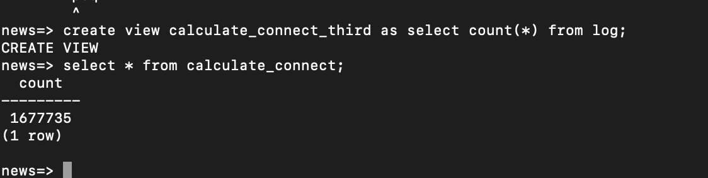
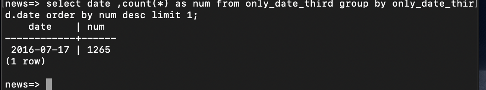

how to use 
```git clone https://github.com/sbuteryd/Analysis-log.git```


需要把文件Analysis-log.git 放入虚拟你运行(vagrant)
虚拟机说明: [Udacity 虚拟机安装说明](https://classroom.udacity.com/nanodegrees/nd004/parts/51200cee-6bb3-4b55-b469-7d4dd9ad7765/modules/c57b57d4-29a8-4c5f-9bb8-5d53df3e48f4/lessons/5475ecd6-cfdb-4418-85a2-f2583074c08d/concepts/14c72fe3-e3fe-4959-9c4b-467cf5b7c3a0?contentVersion=5.0.0&contentLocale=en-us)

 在执行文件前需要安装 psycopg2 模块
```pip  install psycopg2```
 
use python 2.7.6

``` python log_analysis.py```


统计所有的访问记录


统计最多错误的一天




log_fist view 如下内容，找出路径，和成功访问的。

表格内容：

    news=> \d log_fist
    Column   | Type | Modifiers 
    -----------+------+-----------
    substring | text | 
    status    | text | 
 
      substring       | status 
    ----------------------+--------
    candidate-is-jerk    | 200 OK
    goats-eat-googles    | 200 OK

 
 
view: authors_second

